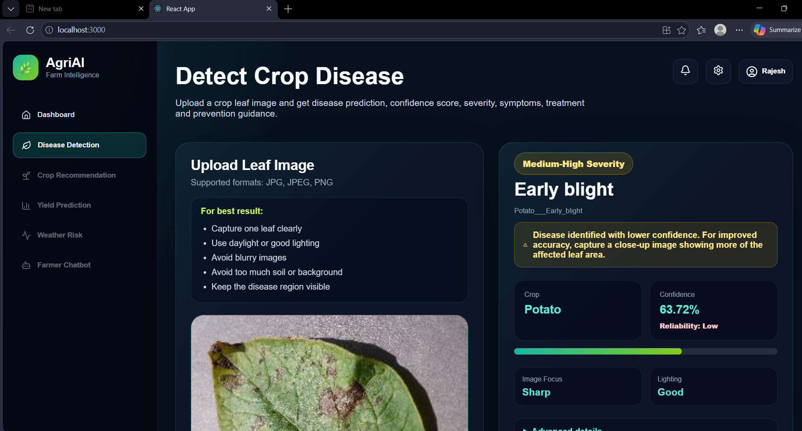
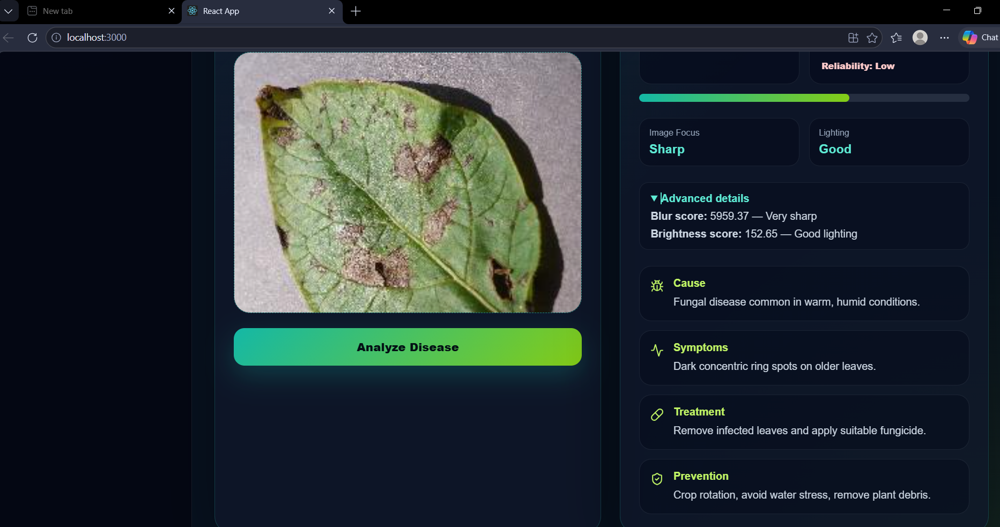
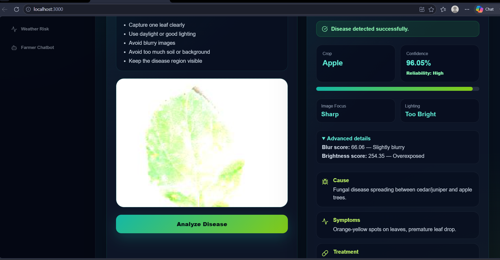
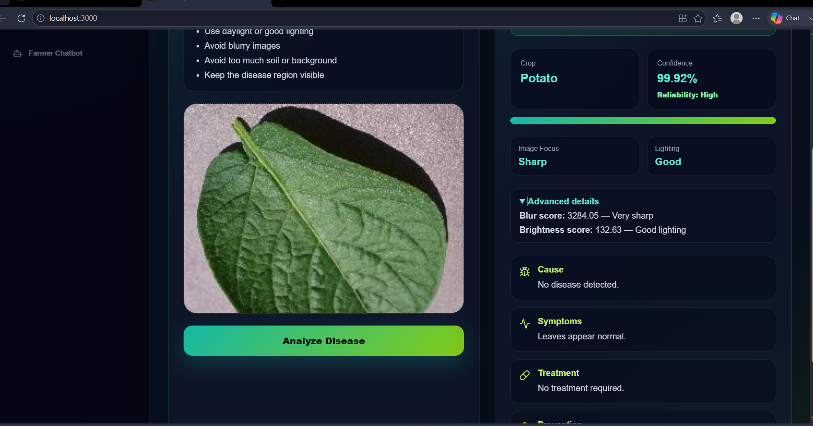

# 🌿 AgriAI Sense V1

### AI-Powered Crop Disease Detection & Agricultural Advisory Platform

AgriAI Sense V1 is an intelligent agriculture platform that leverages Artificial Intelligence, Computer Vision, and Deep Learning to detect crop diseases from leaf images and provide actionable treatment recommendations to farmers.

The platform combines disease detection, image quality assessment, confidence evaluation, and agricultural advisory into a single farmer-friendly application.

---

# 🚀 Project Overview

Crop diseases are one of the major causes of agricultural yield loss worldwide. Farmers often struggle to identify diseases accurately during the early stages of infection.

AgriAI Sense V1 helps solve this problem by allowing farmers to upload crop leaf images and instantly receive:

✅ Disease Identification

✅ Disease Severity Assessment

✅ Confidence Evaluation

✅ Disease Causes

✅ Symptoms

✅ Treatment Recommendations

✅ Prevention Guidance

✅ Image Quality Analysis

The platform is designed for both non-technical farmers and technical users, providing simplified insights alongside advanced diagnostics.

---

# 📸 Application Screenshots

## disease detection 



## low confidence disease Detection 



## High confidence Disease detection



## healthy crop detection



> Create a `screenshots` folder inside the repository and place your application screenshots there.

---

# ✨ Key Features

## 🌱 AI Disease Detection

* CNN-based plant disease classification
* Multi-class disease detection
* Healthy vs Diseased leaf identification
* Real-time prediction
* Confidence-based prediction evaluation

---

## 📷 Smart Image Quality Analysis

Before performing disease prediction, the system evaluates image quality.

### Quality Checks

* Image readability validation
* Blur detection
* Brightness analysis
* Focus assessment

### Farmer-Friendly Results

* Image Focus → Sharp / Blurry
* Lighting → Good / Too Dark / Too Bright

### Advanced Diagnostics

* Blur Score
* Brightness Score
* Quality Classification

---

## 📊 Prediction Confidence Analysis

To improve reliability and transparency, predictions are categorized into reliability levels.

| Confidence Score | Reliability |
| ---------------- | ----------- |
| 90%+             | High        |
| 75% - 89%        | Medium      |
| Below 75%        | Low         |

Low-confidence predictions automatically trigger recommendations for improved image capture.

---

## 💊 Agricultural Advisory Engine

For each detected disease, the platform provides:

* Cause
* Symptoms
* Treatment
* Prevention
* Severity

This transforms the system from a simple classifier into a practical decision-support tool.

---

# 📈 Model Performance

## Dataset

PlantVillage Dataset

## Classification Type

Multi-Class Image Classification

## Total Classes

38 Plant Disease Classes

## Model Architecture

Convolutional Neural Network (CNN)

## Framework

TensorFlow / Keras

## Validation Accuracy

**94% Validation Accuracy**

> Note: PlantVillage contains laboratory-controlled images. Real-world deployment requires additional field image training and validation.

---

# 🌾 Supported Crops

The current version supports diseases across multiple crops including:

* Apple
* Potato
* Tomato
* Corn (Maize)
* Grape
* Peach
* Strawberry
* Pepper
* Orange
* Soybean
* Raspberry
* Cherry
* Squash
* Blueberry

---

# 🦠 Example Diseases Detected

* Apple Scab
* Black Rot
* Cedar Apple Rust
* Potato Early Blight
* Potato Late Blight
* Tomato Mosaic Virus
* Tomato Leaf Mold
* Tomato Yellow Leaf Curl Virus
* Common Rust (Corn)
* Powdery Mildew
* Healthy Leaves

Total Supported Classes: **38**

---

# 🚧 Engineering Challenges Solved

## Challenge 1: Poor Quality Farmer Images

### Problem

Farmers often upload:

* Blurry images
* Dark images
* Overexposed images
* Images containing excessive background noise

### Solution

Implemented image quality validation using OpenCV:

* Blur Detection (Laplacian Variance)
* Brightness Analysis (HSV Channel)
* Image Integrity Verification

This prevents unreliable predictions from poor-quality images.

---

## Challenge 2: Confidence Scores Are Difficult To Interpret

### Problem

Raw confidence values such as:

* 62.4%
* 88.1%
* 99.8%

provide little meaning to non-technical users.

### Solution

Added farmer-friendly reliability indicators:

* High Reliability
* Medium Reliability
* Low Reliability

---

## Challenge 3: Technical Metrics Are Not Farmer Friendly

### Problem

Metrics like:

* Blur Score = 5708
* Brightness Score = 166

are difficult for farmers to understand.

### Solution

Created dual-view diagnostics:

### Farmer View

* Focus: Sharp / Blurry
* Lighting: Good / Too Dark / Too Bright

### Advanced View

* Actual blur score
* Actual brightness score
* Technical quality interpretation

---

## Challenge 4: AI Models Cannot Explain Diseases

### Problem

CNN models only predict disease classes.

### Solution

Implemented a Recommendation Agent connected to a disease knowledge base that provides:

* Cause
* Symptoms
* Treatment
* Prevention
* Severity

---

# 🤖 Agent-Based Architecture

AgriAI follows a modular AI agent architecture.

## Disease Detection Agent

### Responsibilities

* Image preprocessing
* CNN inference
* Confidence calculation
* Crop extraction
* Disease classification

### Output

* Crop
* Disease
* Confidence
* Prediction Status

---

## Recommendation Agent

### Responsibilities

* Query disease knowledge base
* Retrieve disease information
* Generate farmer recommendations

### Output

* Cause
* Symptoms
* Treatment
* Prevention
* Severity

---

# 🏗 System Architecture

```text
Frontend (React.js)
        │
        ▼
 FastAPI Backend
        │
        ▼
Disease Detection Agent
        │
        ▼
 CNN Model (TensorFlow)
        │
        ▼
Recommendation Agent
        │
        ▼
Disease Knowledge Base
        │
        ▼
 Farmer Advisory Response
```

# 🛠 Technology Stack

## Frontend

* React.js
* Axios
* CSS3
* Lucide React Icons

## Backend

* FastAPI
* Python

## Machine Learning

* TensorFlow
* Keras
* NumPy

## Computer Vision

* OpenCV
* Pillow

## Knowledge Layer

* JSON Knowledge Base

---

# 📂 Project Structure

```text
AgriAI/

├── backend/
│   ├── agents/
│   │   ├── disease_detection_agent.py
│   │   └── recommendation_agent.py
│   │
│   ├── knowledge/
│   │   └── disease_knowledge.json
│   │
│   ├── model/
│   │   └── trained_plant_disease_model.keras
│   │
│   ├── uploads/
│   │
│   └── app.py
│
├── frontend/
│   ├── components/
│   ├── pages/
│   ├── App.js
│   └── App.css
│
├── screenshots/
│
├── requirements.txt
│
└── README.md
```

# ⚙️ Installation

## Backend Setup

### Create Virtual Environment

```bash
python -m venv venv
```

### Activate Environment

```bash
venv\Scripts\activate
```

### Install Dependencies

```bash
pip install -r requirements.txt
```

### Run FastAPI Backend

```bash
uvicorn app:app --reload
```

Backend URL:

```text
http://127.0.0.1:8000
```

---

## Frontend Setup

### Install Dependencies

```bash
npm install
```

### Start React Application

```bash
npm start
```

Frontend URL:

```text
http://localhost:3000
```

---

# 🔄 Sample Workflow

1. Upload crop leaf image
2. System validates image quality
3. Image preprocessing performed
4. CNN model predicts disease
5. Confidence score calculated
6. Knowledge base queried
7. Recommendations generated
8. Results displayed to farmer

---

# 🔮 Future Roadmap

## Phase 2

* AI Farmer Chatbot
* Weather Risk Prediction
* Crop Recommendation Engine
* Scan History Tracking

## Phase 3

* Multi-language Support
* Voice-based Farmer Assistant
* Mobile Application
* PDF Report Generation

## Phase 4

* Multi-Agent Agricultural Intelligence System
* Yield Forecasting
* Market Price Prediction
* Precision Farming Analytics
* IoT Sensor Integration

---

# 🎯 Real-World Impact

AgriAI helps farmers:

✅ Detect diseases early

✅ Reduce crop losses

✅ Improve treatment decisions

✅ Monitor crop health more effectively

✅ Access AI-powered agricultural guidance

✅ Improve farming productivity

The platform demonstrates how Artificial Intelligence can be applied to solve practical agricultural challenges and support modern precision farming initiatives.

---

# 👨‍💻 Author

**Sheetal Sharma**

AI Engineer | Data Science Enthusiast | Agriculture Intelligence Systems

AgriAI Sense V1
